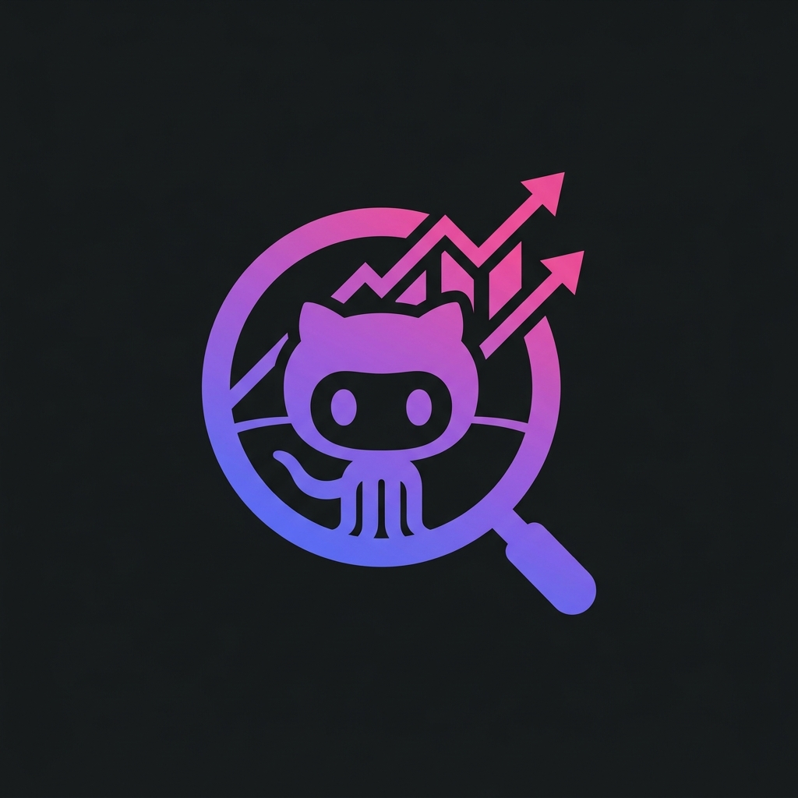

<p align="center">
  
</p>

<h1 align="center">🔮 GitHub Analiz Motoru</h1>
<h3 align="center"><i>GitHub Analysis Engine</i></h3>

<p align="center">
  <em>Bir GitHub profili girer, bir kahve alırsınız. Döndüğünüzde, yapay zeka için hazırlanmış profesyonel bir rapor sizi bekliyor olacaktır. ☕</em>
  <br/>
  <em>Enter a GitHub profile, grab a coffee. When you return, a professional AI-ready report will be waiting for you. ☕</em>
</p>

<p align="center">
  
  
  
  
  
  <br/><br/>
  <a href="https://github-analisti.vercel.app/">
    
  </a>
</p>

---

## 🇹🇷 Türkçe

### 🎭 Bu da ne?

Bir geliştiriciyi tanımak için profiline bakmak yeterli değildir dostum. Repoların derinlerine dalmak, kodun ruhunu hissetmek, commit geçmişinde kaybolmak gerekir... Ama kim uğraşacak? 😏

**GitHub Analiz Motoru** tam da bu yüzden var. Bir kullanıcı adı yaz, gerisini biz halledelim. Profil verileri, en yıldızlı repolar, son güncellenen projeler, README'ler, aktivite geçmişi, dil dağılımı... Hepsi toplanır, harmanlenir ve yapay zeka için mükemmel bir prompt olarak sunulur.

> *"Kod yazmak kolaydır. Başkasının kodunu anlamak ise... bir sanattır." — Anonim, muhtemelen bir debugger başında ağlarken söylemiştir.*

### ✨ Yetenekler (Ki Azımsanacak Gibi Değiller)

| Özellik | Açıklama |
|---------|----------|
| 🧠 **Profil Matrisi** | İsim, bio, lokasyon, şirket, hesap yaşı, takipçi/takip oranı |
| ⭐ **En Popüler Repolar** | Yıldıza göre sıralı, ilk 6 proje detaylı kartlarda |
| 🕐 **Son Güncellenen Repolar** | Aktif projeleri anlık takip, "ne zaman güncelledi?" sorusuna cevap |
| 📖 **README Önizlemesi** | En iyi 3 reponun README dosyası çekilir ve markdown olarak render edilir |
| 🌈 **Dil Dağılımı** | GitHub tarzı renk kodlu çubuk grafik |
| 📊 **6'lı İstatistik Paneli** | Yıldız, fork, repo sayısı, takipçi, ort. yıldız, izleyici |
| 🚀 **Aktivite Akışı** | Son 8 public event: push, star, fork, PR, issue... |
| 🤖 **AI Mega Prompt** | Tüm veriler tek bir prompt'ta — ChatGPT, Claude veya Gemini'ye yapıştır, gerisi gelsin |
| 🌍 **Çift Dil** | Türkçe ↔ İngilizce arayüz desteği |

### 🎨 Bir de Güzel Görünüyor

Glassmorphism efektleri, gradient ışıltılar, animasyonlu kartlar, responsive tasarım... Siyah bir tuval üzerine mor ve indigo tonlarında çizilmiş bir şaheser. Karanlıkta parlayan bir mücevher gibi düşünün. 💎

### 🔌 Kullanılan API'ler

Bu uygulama aşağıdaki **GitHub REST API v3** endpoint'lerini kullanmaktadır:

| Endpoint | Amaç |
|----------|-------|
| `GET /users/{username}` | Profil bilgileri (avatar, bio, istatistikler) |
| `GET /users/{username}/repos` | Repo listesi (en fazla 100, güncellemeye göre sıralı) |
| `GET /users/{username}/events/public` | Son public aktiviteler |
| `GET /repos/{owner}/{repo}/readme` | README dosya içeriği (ham markdown) |

> ⚠️ GitHub API, kimlik doğrulaması olmadan **saatte 60 istek** ile sınırlıdır. Yoğun kullanımda rate limit'e takılabilirsiniz. Ama endişelenmeyin, hata mesajları gayet kibar. 🤝

### 🚀 Kurulum

```bash
# Repoyu klonlayın (sırlar burada gizli 🕵️)
git clone https://github.com/AniLLL3734/GithubAnalisti.git
cd GithubAnalisti

# Bağımlılıkları yükleyin (biraz sabır, büyük şeyler zaman alır)
npm install

# Geliştirme sunucusunu başlatın
npm run dev
```

Tarayıcınızda `http://localhost:5173` adresini açın ve keyfini çıkarın. 🎉

### 📦 Teknoloji Yığını

- **React 19** — UI kütüphanesi
- **Vite 8** — Işık hızında build tool
- **Tailwind CSS 4** — Utility-first CSS
- **Axios** — HTTP istekleri
- **react-icons** — İkon kütüphanesi
- **react-markdown + remark-gfm** — README render
- **GitHub REST API v3** — Veri kaynağı

---

## 🇬🇧 English

### 🎭 What Is This Sorcery?

To truly know a developer, you don't just peek at their profile. You dive deep into their repos, feel the soul of their code, get lost in their commit history... But who has time for that? 😏

**GitHub Analysis Engine** exists precisely for this reason. Type a username, and let us handle the rest. Profile data, top starred repos, recently updated projects, READMEs, activity history, language distribution... Everything is gathered, blended, and served as the perfect prompt for AI analysis.

> *"Writing code is easy. Understanding someone else's code is... an art form." — Anonymous, probably said while crying in front of a debugger.*

### ✨ Features (And They're Not To Be Underestimated)

| Feature | Description |
|---------|-------------|
| 🧠 **Profile Matrix** | Name, bio, location, company, account age, follower/following ratio |
| ⭐ **Top Repos** | Sorted by stars, top 6 projects displayed in detailed cards |
| 🕐 **Recently Updated** | Track active projects in real-time, answers "when did they last push?" |
| 📖 **README Preview** | Top 3 repo READMEs fetched and rendered as markdown |
| 🌈 **Language Distribution** | GitHub-style color-coded bar chart |
| 📊 **6-Panel Stats** | Stars, forks, repo count, followers, avg stars, watchers |
| 🚀 **Activity Feed** | Last 8 public events: push, star, fork, PR, issue... |
| 🤖 **AI Mega Prompt** | All data in one prompt — paste into ChatGPT, Claude, or Gemini |
| 🌍 **Bilingual** | Turkish ↔ English interface support |

### 🎨 And It Looks Gorgeous

Glassmorphism effects, gradient glows, animated cards, responsive design... A masterpiece painted in purple and indigo tones on a dark canvas. Think of it as a jewel that glows in the dark. 💎

### 🔌 APIs Used

This application uses the following **GitHub REST API v3** endpoints:

| Endpoint | Purpose |
|----------|---------|
| `GET /users/{username}` | Profile info (avatar, bio, stats) |
| `GET /users/{username}/repos` | Repo list (up to 100, sorted by update date) |
| `GET /users/{username}/events/public` | Recent public activity events |
| `GET /repos/{owner}/{repo}/readme` | README file content (raw markdown) |

> ⚠️ GitHub API is limited to **60 requests per hour** without authentication. You might hit rate limits during heavy usage. But don't worry, the error messages are quite polite. 🤝

### 🚀 Installation

```bash
# Clone the repo (secrets are hidden here 🕵️)
git clone https://github.com/AniLLL3734/GithubAnalisti.git
cd GithubAnalisti

# Install dependencies (patience, great things take time)
npm install

# Start the dev server
npm run dev
```

Open `http://localhost:5173` in your browser and enjoy. 🎉

### 📦 Tech Stack

- **React 19** — UI library
- **Vite 8** — Lightning-fast build tool
- **Tailwind CSS 4** — Utility-first CSS
- **Axios** — HTTP client
- **react-icons** — Icon library
- **react-markdown + remark-gfm** — README rendering
- **GitHub REST API v3** — Data source

---

<p align="center">
  <b>🧙‍♂️ Yapımcı / Creator</b>
  <br/>
  <a href="https://github.com/AniLLL3734">
    
  </a>
</p>

<p align="center">
  <em>Her commit bir hikayedir. Her repo bir maceradır. Her yıldız bir teşekkür. ⭐</em>
  <br/>
  <em>Every commit is a story. Every repo is an adventure. Every star is a thank you. ⭐</em>
</p>

<p align="center">
  <sub>Bu projeyi beğendiyseniz, bir ⭐ bırakmayı unutmayın. Yıldızlar geliştiricilerin yakıtıdır. 🚀</sub>
  <br/>
  <sub>If you liked this project, don't forget to leave a ⭐. Stars are the fuel of developers. 🚀</sub>
</p>
